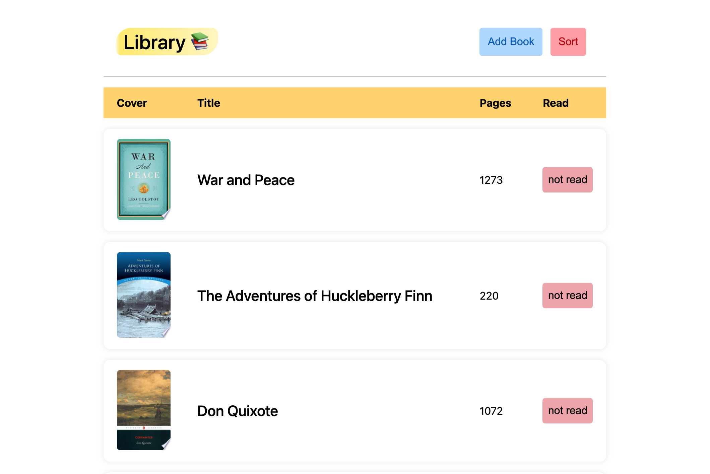

# Library app

This is the first project of the Javascript curriculum in Full Stack Javascript.

It allows you to add and keep track of books that you've read or are planning to read.

## Things to note

* The `<table>` element is used, with custom styling
* A custom modal for isbn, title, and page number is presented
* `fetch` is used to request the Google Books API, which will pre-fill the form using ISBN number
* New books that are added will be set in `localStorage`. If it is the first time opening the site, 3 books will be pushed by default.
* The data source consists of an array of `Book` objects, that will be converted using `stringify` when set and `JSON.parse` when retrieved.

## Screenshots

## Demo

A live preview of the site can be found [here](https://tmprk.github.io/library-app/)